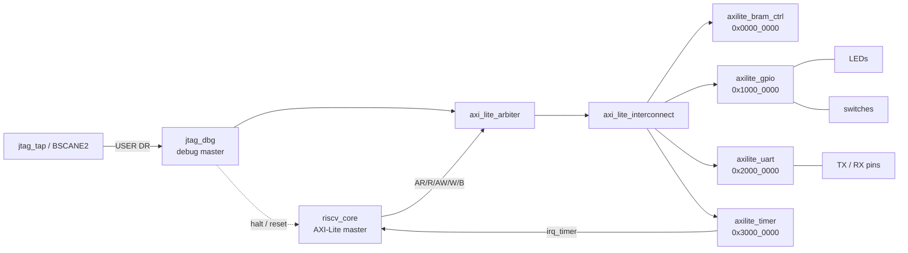
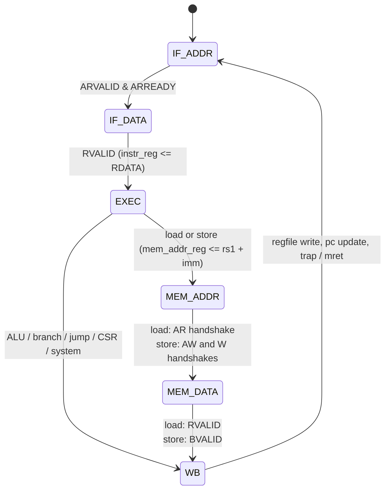

# Architecture

## Top level

`soc_top` instantiates one core, a JTAG debug master, a two-master arbiter,
one interconnect and four slaves. Every
module has one clock (`clk`) and one active-low asynchronous reset (`rst_n`);
`soc_top` synchronises the board reset with a two-flop synchroniser. The
ZCU104 wrapper `fpga/zcu104_top.v` adds the differential clock buffer, the
`/3` clock divider and a 128-cycle power-on reset stretcher.

## Core: `riscv_core`

Multicycle RV32I + Zicsr, machine mode only. One instruction is in flight at a
time.

Cycle cost: 5 cycles for ALU/branch/jump/CSR instructions, 7 for loads and
stores (with the zero-wait-state slaves in this SoC). `mcycle` and `minstret`
give the exact numbers at run time.

**Datapath.** Decode, immediates, the ALU, the branch comparator and the
load/store byte-lane steering are all combinational functions of `instr_reg`,
the register-file read ports and `mem_addr_reg[1:0]`. The register file is
`regs[1:31]`; x0 is a mux, not storage. The write port is registered
(`rd_we`, `rd_waddr`, `rd_wdata`) so the write lands in the cycle after `WB`,
which is always before the next instruction reaches `EXEC`.

**Bus master.** One AXI-Lite master port serves both fetch and data. Address
and control are registered outputs; `ARADDR`/`AWADDR` are held stable for the
whole transaction, which is what lets the interconnect route the response
channels from the *address* without storing a transaction ID.

**Traps.** Taken in `WB`, in priority order:

| Cause | `mcause` | `mepc` | Next PC |
|---|---|---|---|
| `ecall` | 11 | address of the `ecall` | `mtvec` |
| `ebreak` | 3 | address of the `ebreak` | `mtvec` |
| `mret` | — | — | `mepc`, `MIE <= MPIE`, `MPIE <= 1` |
| timer interrupt (`mstatus.MIE & mie.MTIE & mip.MTIP`) | `0x8000_0007` | next sequential/branch target | `mtvec` |

Entering a trap copies `MIE` to `MPIE` and clears `MIE`. `mtvec` is direct
mode only (low two bits ignored). Not implemented: illegal-instruction and
misaligned-access exceptions, `mtval`, user/supervisor modes, vectored
`mtvec`. `wfi` and both `fence` instructions execute as no-ops (there are no
caches or write buffers, and the only other bus master, the debug port, is
serialised with the core by the arbiter, so nothing needs ordering).

**CSRs.** `mstatus` (MIE, MPIE), `mie` (MTIE), `mip` (MTIP, read-only),
`mtvec`, `mscratch`, `mepc`, `mcause`, `mcycle[h]`, `minstret[h]` and their
user-mode aliases `cycle[h]`/`instret[h]`, `misa` = `0x4000_0100`,
`mvendorid`/`marchid`/`mimpid`/`mhartid` = 0. Unknown CSRs read as 0 and
ignore writes.

## Interconnect: `axi_lite_interconnect`

Purely combinational. Read channels are steered by `ARADDR[29:28]`, write
channels by `AWADDR[29:28]`:

| `[29:28]` | Slave |
|---|---|
| `00` | BRAM |
| `01` | GPIO |
| `10` | UART |
| `11` | Timer |

`ARVALID`/`AWVALID`/`WVALID`/`RREADY`/`BREADY` are gated per slave; the
response signals are multiplexed back with the same select. Because the core
never has more than one read and one write outstanding and holds the address
until the response is accepted, no per-transaction state is required.
Unmapped addresses inside a slave's window wrap onto that slave (no `DECERR`).

## Slaves

All four slaves share the same two-state handshake structure for each
direction: `IDLE` (ready asserted) → capture on handshake → `RESP` (valid
asserted until accepted). For writes, `AW` and `W` are accepted together in
one cycle, which the core always supplies.

**BRAM** (`axilite_bram_ctrl`): 8192 × 32 bits, byte-write-enable, one read
port and one write port on the same clock. The memory array lives in its own
reset-free clocked block so Vivado infers block RAM (8 × RAMB36), and the
`$readmemh` initialisation is synthesisable, so the program is part of the
bitstream. Address bits `[14:2]` select the word; bits above are ignored.

**GPIO** (`axilite_gpio`): `OUT` register with byte strobes, `IN` sampled
directly (the board wrapper feeds it the DIP switches and push buttons).

**UART** (`axilite_uart` + `uart_tx` + `uart_rx`): 8N1, `CLKS_PER_BIT`
parameter (868 at 100 MHz for 115200 baud; the testbenches use 20). One-byte
TX holding register, one-byte RX register with a `valid` flag cleared by
reading `RX`. The receiver has a two-flop synchroniser and samples at
mid-bit; no FIFOs, no parity, no flow control.

**Timer** (`axilite_timer`): 32-bit counter that runs while `CTRL.enable`
is set and wraps to zero after reaching `COMPARE`. Each wrap sets
`STATUS.pending`; `irq = CTRL.irq_en & STATUS.pending`. Software clears
`pending` by writing 1 to `STATUS`.

## JTAG debug port

`jtag_dbg` hangs off a TAP's USER data register and gives a host three
things: **halt / resume / reset** of the core, and **read / write of any bus
address** through its own AXI-Lite master. That is enough to load a program
into the BRAM and start it without touching the bitstream, to inspect
peripheral registers while the program runs, and to stop the core at an
instruction boundary.

Two TAPs can sit in front of it, with the same seven-signal interface
(`sel`, `capture`, `shift`, `update`, `tck`, `tdi`, `tdo`):

* `rtl/jtag_tap.v` — an IEEE 1149.1 TAP with a 4-bit IR (IDCODE, BYPASS,
  USER). Used in simulation (`tests/tb/tb_jtag.v` drives real TMS/TDI
  sequences) and usable with a discrete JTAG header.
* Xilinx `BSCANE2` (USER1) — used in `fpga/zcu104_top.v`, so the debug port
  is reached through the FPGA's own JTAG chain and the board's USB-JTAG, with
  no extra pins. `fpga/jtag_host.tcl` drives it from the Vivado hardware
  manager (`scan_ir_hw_jtag` / `scan_dr_hw_jtag`; ZU7EV IR = 12 bits,
  USER1 = `0x902`, from the BSDL).

**Data register (66 bits, LSB first).** Shift in `{addr[31:0], data[31:0],
op[1:0]}` with `op` = 0 nop, 1 read, 2 write, 3 control (`data[0]` halt,
`data[1]` core reset). The request is issued on Update-DR. Shift out
`{0, reset, halt_req, halted, rdata[31:0], 0, busy}`; the host polls with
`op = nop` until `busy` clears, then `rdata` holds the last read.

**Clock crossing.** TCK and the SoC clock are unrelated. A request toggles a
flag in the TCK domain; a three-flop synchroniser in the SoC domain detects
the edge, performs the bus transaction, and toggles an acknowledge flag that
is synchronised back. Payload registers are only read after the flag has
crossed, so they are stable when sampled.

**Arbitration.** `axi_lite_arbiter` puts the core (`m0`, priority) and the
debug master (`m1`) in front of the interconnect. `m1` is granted only when
`m0` has nothing in flight and keeps the bus until its transaction completes;
meanwhile `m0`'s valids are masked and its readies held low, so the core
simply stalls a few cycles. No transaction is ever cut short.

**Halt.** `dbg_halt_req` is honoured in `IF_ADDR` before the fetch is issued,
so a halted core has no bus transaction pending and `dbg_halted` means "at an
instruction boundary, idle". A debugger-initiated core reset (`dbg_core_rst`)
resets only the core, not the peripherals or the debug logic, so the usual
sequence is halt -> load -> reset -> release.

## Reset and clocking on the board

`zcu104_top`: `IBUFDS` on the 300 MHz DDR4-bank clock, `BUFGCE_DIV(3)` for
100 MHz. There is no MMCM, so the design has no IP to regenerate and no
locked-signal handling. The `CPU_RESET` button (active high) is synchronised
and stretched; the SoC also releases reset by itself 128 cycles after
configuration.

## Verification

* `tests/isa/run_isa.py` compiles each `riscv-tests` rv32ui program against
  a small environment (`tests/isa/env/riscv_test.h`) that reports PASS/FAIL
  through `GPIO_OUT` instead of the `tohost` CSR mechanism, converts the ELF
  to a `$readmemh` image and runs it under `tests/tb/tb_isa.v`.
* `tb_isa.v` loads the image into the BRAM array, decodes the UART transmit
  line onto the console, optionally injects characters into the receive line
  once the SoC's own transmitter has gone quiet, and stops on the PASS/FAIL
  code or a watchdog.
* `tests/tb/tb_jtag.v` (`scripts/run_jtag.py`) reads IDCODE, halts the
  core, loads a program word by word over JTAG, reads it back, resets and
  releases the core, peeks `GPIO_IN` and `TIMER_COUNT` while it runs, and
  waits for the program's PASS code.
* Every program in `sw/` has a `make sim` target that builds with
  `-DSIM_BUILD` (short delays, self-terminating) and runs through the same
  testbench, so the demos double as regression tests.
